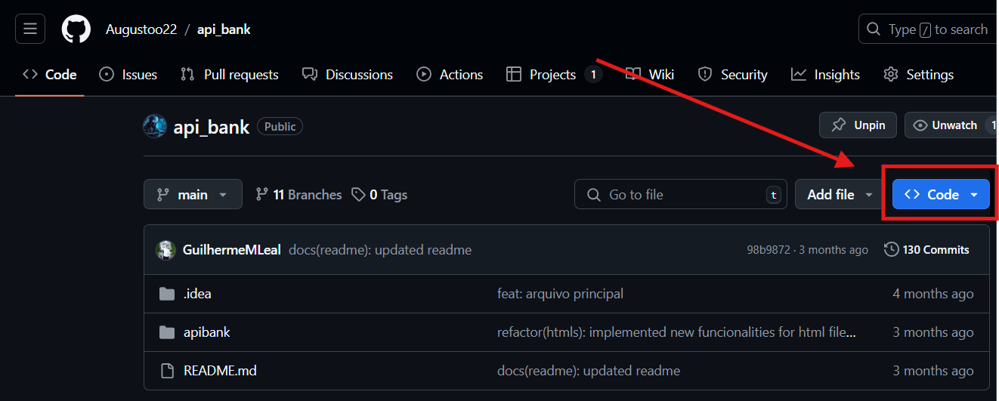

# Execução passo a passo

---

Para executar o projeto, acesse o link do repositório abaixo. Lá, você poderá clonar o projeto em seu computador e executá-lo. 

https://github.com/Augustoo22/api_bank/tree/main

Agora que você acessou o repositório, siga o passo a passo abaixo:

### Passo 1

---



Ao acessar o repositório, sua tela estará semelhante à imagem abaixo. Para continuar, clique no botão "Code".

### Passo 2

---


Após clicar no botão "Code", uma janela será aberta. Nela, copie o endereço que está destacado, conforme mostrado na imagem.

### Passo 3

---


Após copiar o endereço, abra o **cmd** ou **Git Bash** no diretório desejado. Digite ou cole o comando abaixo, e após isso, pressione **Enter** para executar:

```powershell
git clone https://github.com/Augustoo22/api_bank.git
```

### Passo 4

---


Após executar o comando, abra a IDE de sua preferência (como IntelliJ, VSCode, Eclipse, etc.).

### Passo 5

---


Na IDE que você escolheu, clique em **"Open Folder"** para abrir o diretório onde o projeto foi clonado.

### Passo 6

---


Abra a pasta **"api_bank"**, que contém o projeto

### Passo 7

---


Dentro do projeto, no terminal da sua IDE, execute o comando:

```powershell
cd .\apibank\
```

Isso irá te direcionar para o diretório principal do projeto "api_bank".

### Passo 8

---


Agora, será necessário abrir o Docker. Se você ainda não o tem instalado, veja os links abaixo para instruções de instalação:

***Como abaixar docker:***

[https://www.youtube.com/watch?v=7WuZU7xP2ng](https://www.youtube.com/watch?v=7WuZU7xP2ng)

[https://docs.docker.com/desktop/install/windows-install/](https://docs.docker.com/desktop/install/windows-install/)

### Passo 9

---


Para executar o projeto em Docker, você precisará usar o seguinte comando:

```powershell
docker-compose up --build
```

Esse comando realiza duas ações ao mesmo tempo:

1. **Reconstrói** as imagens Docker, se necessário.
2. **Inicia** os contêineres definidos no arquivo `docker-compose.yml`.

### Passo 10

---


Acesse o container “apibank”

### Passo 11

---


Acesse a URL 8080

### Passo 12

---


Acesse a URL `localhost:8080/usuarios`

### Passo 13

---


Você verá a aplicação em execução. Para começar a interagir com ela, crie uma conta conforme necessário.

### Passo 14

---


Após preencher todos os campos, clique em **"Enviar"** para concluir o processo de criação da conta.

### Passo 15

---


Com a conta criada, acesse a plataforma usando suas credenciais recém-criadas.

### Passo 16

---


Dentro da plataforma, para realizar uma operação como um PIX, acesse a página específica usando o link destacado.

### Passo 17

---


Na área de PIX, insira a chave (que é um ID) no campo apropriado e coloque o valor no outro campo. Após preencher as informações, clique em **"Enviar"**. Em seguida, você verá o saldo diminuir conforme a transação realizada.

### Passo 18

---


Agora, para editar seu cadastro, acesse o link destacado.

### Passo 19

---


No exemplo, altere o nome de **"Exemplo1"** para **"Exemplo10"**.

### Passo 20

---


Após a edição, você poderá visualizar o registro do histórico de PIX realizados.

### Passo 21

---


Aqui estão os registros dos PIX realizados. Dessa forma, você pode verificar como a aplicação é executada e como as dependências são baixadas.